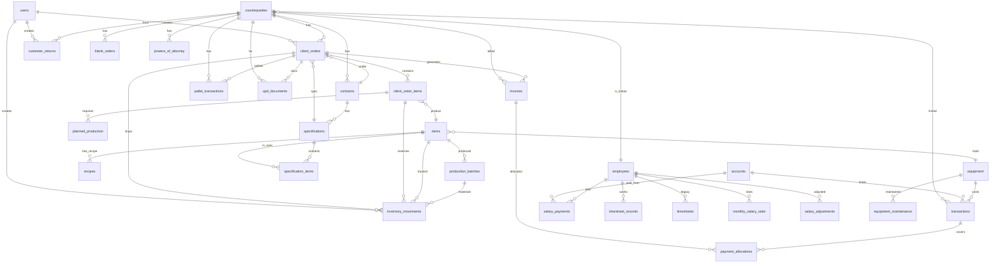

# 📐 ERP PLITTEX — ДЕРЕВО АРХИТЕКТУРЫ (Операция «ПАНОПТИКУМ»)

> **Дата генерации:** 01.04.2026  
> **Источник:** Полное сканирование файловой системы и схемы PostgreSQL

---

## 🌳 ФАЙЛОВАЯ СТРУКТУРА ПРОЕКТА

```
plittex-erp/
│
├── web.js                          # 🏠 Точка входа (Express + Socket.IO + EJS + Pool)
├── package.json                    # 📦 Зависимости
├── .env                            # 🔐 Конфигурация (JWT_SECRET, DADATA_TOKEN, DB_*)
│
├── middleware/
│   └── auth.js                     # 🔒 JWT + requireAdmin (RBAC)
│
├── utils/
│   └── telegram.js                 # 📲 Telegram Bot Notify
│
├── migrations/                     # 📋 SQL-миграции
│   └── *.sql
│
├── routes/                         # ⚙️  BACKEND ROUTES (Express Router)
│   ├── dictionaries.js             # 📖 Справочники: Items, Employees, Equipment
│   ├── production.js               # 🏭 Производство: Замесы, Черновики, Фиксация, MRP
│   ├── inventory.js                # 📦 Склад: Движения, Закупки, Аудит, Резервы (WH7)
│   ├── sales.js                    # 💼 Продажи: Checkout, Отгрузка, Kanban, Blank Orders
│   ├── hr.js                       # 👤 HR: Табель, ЗП, КТУ, Закрытие периода
│   ├── finance.js                  # 💰 Финансы: P&L, Транзакции, Контрагенты, Счета, CRM
│   ├── docs.js                     # 📄 Документы: Счет, УПД, Накладная, КП, Акт, 1С-выгрузка
│   └── dev.js                      # 🛠️  DEV-ONLY: Unlock, Hard delete (guard: DEV_MODE)
│
├── views/
│   ├── layout.ejs                  # 🖼️  Мастер-шаблон (навигация, sidebar)
│   ├── login.ejs                   # 🔑 Страница логина
│   │
│   ├── modules/                    # 📊 EJS-виджеты модулей
│   │   ├── dashboard.ejs           # 📈 Дашборд (Себестоимость, Stock Valuation, Global Search)
│   │   ├── production.ejs          # 🏭 Производство (Формовка, Сушка, Экономика партии)
│   │   ├── inventory.ejs           # 📦 Склад (Остатки, Закупки, Списание, Резервы WH7)
│   │   ├── sales.ejs               # 💼 Продажи (Checkout, Kanban, История, Бланки)
│   │   ├── salary.ejs              # 💵 ЗП (Табель, Начисления, Закрытие)
│   │   ├── finance.ejs             # 💰 Финансы (Транзакции, P&L, Контрагенты)
│   │   ├── equipment.ejs           # ⚙️  Оборудование (Станки, Формы, Поддоны)
│   │   ├── recipes.ejs             # 🧪 Рецептуры (Продуктовые + Шаблоны замесов)
│   │   ├── references.ejs          # 📖 Справочники (Товары, Кадры, Прайс)
│   │   ├── purchase.ejs            # 🛒 Закупки (История, Журнал)
│   │   └── docs_registry.ejs       # 📋 Реестр документов (Бухгалтерия, 1С)
│   │
│   └── docs/                       # 📄 Печатные формы
│       ├── invoice.ejs             # Счет на оплату
│       ├── upd.ejs                 # Универсальный передаточный документ
│       ├── waybill.ejs             # Расходная накладная
│       ├── contract.ejs            # Договор поставки
│       ├── specification.ejs       # Спецификация
│       ├── blank_order.ejs         # Бланк заказа
│       ├── passport.ejs            # Паспорт партии
│       ├── act.ejs                 # Акт сверки
│       ├── kp.ejs                  # Коммерческое предложение
│       ├── card_tochka.ejs         # Карточка реквизитов (Точка)
│       └── card_alfa.ejs           # Карточка реквизитов (Альфа)
│
├── public/
│   ├── css/
│   │   └── style.css               # 🎨 Единая таблица стилей
│   │
│   ├── js/                         # 🖥️  FRONTEND LOGIC (Client-side)
│   │   ├── auth-flow.js            #     2.4 kB — Логин/JWT
│   │   ├── dashboard.js            #    65.7 kB — Дашборд (Cost Triad, Stock Valuation)
│   │   ├── production.js           #    69.9 kB — Производство
│   │   ├── inventory.js            #    28.2 kB — Склад
│   │   ├── sales.js                #   180.1 kB — Продажи (САМЫЙ БОЛЬШОЙ ФАЙЛ)
│   │   ├── salary.js               #   110.4 kB — ЗП и Табель
│   │   ├── finance.js              #   241.1 kB — Финансы (ВТОРОЙ ПО РАЗМЕРУ)
│   │   ├── recipes.js              #    43.8 kB — Рецептуры
│   │   ├── equipment.js            #    16.3 kB — Оборудование
│   │   ├── references.js           #    14.5 kB — Справочники
│   │   ├── purchases.js            #    38.2 kB — Закупки  
│   │   └── docs_registry.js        #    13.4 kB — Реестр документов
│   │
│   └── saved_docs/                 # 📂 PDF-хранилище (ротация 500 файлов)
│
├── .antigravity/                   # 🤖 ИИ-Инструкции и протоколы (Zero-Terminal, DB Rules)
├── .agent/workflows/               # 📜 Автоматизированные рабочие процессы ИИ (main, refactor_ui)
├── _import_data/                   # 📥 Исходники данных (Прайсы Excel, PDF, TXT)
│
├── project_glossary.md             # 📖 Словарь терминов проекта (Warehouse ID, Big.js)
├── erp_architecture_tree.md        # 📐 Дерево архитектуры и схемы БД
├── erp_master_audit_list.md        # 🛡️ Сводный лог аудита уязвимостей
└── erp_technical_docs.md           # 📘 Техническая документация модулей
```

---

## 🗄️ СХЕМА БАЗЫ ДАННЫХ (42 таблицы)

### Граф связей (Entity Relationship)



---

### Таблицы по модулям

#### 📖 Справочники (Master Data)
| Таблица | Колонок | Размер | Soft Delete | Индексы |
|---|---|---|---|---|
| `items` | 20 | 552 kB | ✅ `is_deleted` | PK, `unique_article`, GIN(name) |
| `employees` | 12 | 24 kB | ✅ `status='deleted'` | PK |
| `equipment` | 12 | 24 kB | ❌ Hard | PK |
| `warehouses` | 3 | 24 kB | ❌ — | PK |

#### 🏭 Производство
| Таблица | Колонок | Размер | Soft Delete | Индексы |
|---|---|---|---|---|
| `production_batches` | 21 | 56 kB | ❌ Hard | PK only ⚠️ |
| `recipes` | 4 | 656 kB | ❌ Hard | PK, idx_product, idx_material |
| `settings` | 2 | 72 kB | — | PK(key) |

#### 📦 Склад
| Таблица | Колонок | Размер | Soft Delete | Индексы |
|---|---|---|---|---|
| `inventory_movements` | 16 | 144 kB | ❌ Hard | PK, idx_item(×2), idx_warehouse, idx_order |

#### 💼 Продажи
| Таблица | Колонок | Размер | Soft Delete | Индексы |
|---|---|---|---|---|
| `client_orders` | 24 | 112 kB | ❌ Hard | PK, idx_status, idx_counterparty, idx_doc_num, idx_created, idx_auto_num |
| `client_order_items` | 8 | 24 kB | ❌ Hard | PK |
| `blank_orders` | 10 | 8 kB | ❌ Hard | PK |
| `planned_production` | 6 | 24 kB | ❌ Hard | PK |
| `customer_returns` | 7 | 32 kB | ❌ Hard | PK |
| `customer_return_items` | 6 | 8 kB | ❌ Hard | PK |

#### 💰 Финансы
| Таблица | Колонок | Размер | Soft Delete | Индексы |
|---|---|---|---|---|
| `transactions` | 26 | 3288 kB | ✅ `is_deleted` | PK, 14 индексов (вкл. partial, GIN) |
| `accounts` | 6 | 112 kB | ❌ Hard | PK, unique(name), idx_employee |
| `counterparties` | 27 | 480 kB | ❌ Hard | PK, idx_inn, idx_phone, GIN(name) |
| `invoices` | 14 | 128 kB | ❌ status='cancelled' | PK, unique(invoice_number), 5 индексов |
| `transaction_categories` | 4 | 80 kB | ❌ Hard | PK, unique(name, type) |
| `planned_expenses` | 7 | 16 kB | ❌ status | PK |
| `payment_allocations` | 5 | 24 kB | ❌ Hard | PK, idx_invoice, idx_transaction |
| `transaction_rules` | 5 | 16 kB | ❌ Hard | PK |
| `dashboard_rules` | 3 | 32 kB | — | PK(original_category) |

#### 👤 HR & Зарплата
| Таблица | Колонок | Размер | Soft Delete | Индексы |
|---|---|---|---|---|
| `timesheet_records` | 11 | 96 kB | ❌ Hard | PK, unique(emp, date) |
| `timesheets` | 8 | 48 kB | ❌ (⚠️ ORPHAN) | PK, unique(emp, date) |
| `salary_payments` | 8 | 64 kB | ❌ Hard | PK |
| `salary_adjustments` | 5 | 32 kB | ❌ Hard | PK |
| `monthly_salary_stats` | 7 | 40 kB | ❌ Hard | PK, unique(emp, month) |
| `closed_periods` | 5 | 40 kB | ❌ Hard | PK, unique(period, module) |

#### 📄 Документы
| Таблица | Колонок | Размер | Soft Delete | Индексы |
|---|---|---|---|---|
| `contracts` | 5 | 24 kB | ❌ Hard | PK |
| `specifications` | 4 | 24 kB | ❌ Hard | PK |
| `specification_items` | 6 | 24 kB | ❌ Hard | PK |
| `powers_of_attorney` | 7 | 24 kB | ❌ Hard | PK |
| `pallet_transactions` | 6 | 24 kB | ❌ Hard | PK, idx_counterparty |
| `upd_documents` | 14 | 56 kB | ❌ Hard | PK, unique(doc_number), 4 индекса |
| `document_counters` | 2 | 24 kB | — | PK(prefix) |
| `document_sequences` | 3 | 24 kB | — | PK(doc_type) |

#### ⚙️ Системные
| Таблица | Колонок | Размер | Индексы |
|---|---|---|---|
| `users` | 5 | 48 kB | PK, unique(username) |
| `migrations` | 3 | 40 kB | PK, unique(filename) |
| `global_settings` | 2 | 32 kB | PK(setting_key) |
| `equipment_maintenance` | 5 | 16 kB | PK |

---

## 🔗 КАРТА FOREIGN KEYS (Критические связи)

### ON DELETE CASCADE (⚠️ Опасные каскады)
| Parent | Child | Колонка |
|---|---|---|
| `counterparties` | `client_orders` | counterparty_id |
| `counterparties` | `contracts` | counterparty_id |
| `counterparties` | `blank_orders` | counterparty_id |
| `counterparties` | `powers_of_attorney` | counterparty_id |
| `counterparties` | `pallet_transactions` | counterparty_id |
| `counterparties` | `customer_returns` | counterparty_id |
| `counterparties` | `transaction_rules` | counterparty_id |
| `client_orders` | `client_order_items` | order_id |
| `client_order_items` | `planned_production` | order_item_id |
| `items` | `client_order_items` | item_id |
| `items` | `blank_orders` | item_id |
| `items` | `planned_production` | item_id |
| `items` | `customer_return_items` | item_id |
| `contracts` | `specifications` | contract_id |
| `specifications` | `specification_items` | specification_id |
| `customer_returns` | `customer_return_items` | return_id |

### ON DELETE SET NULL (Безопасные)
| Parent | Child | Колонка |
|---|---|---|
| `contracts` | `client_orders` | contract_id |
| `equipment` | `items` | mold_id |
| `client_orders` | `inventory_movements` | order_id |
| `client_order_items` | `inventory_movements` | linked_order_item_id |
| `client_orders` | `invoices` | order_id |
| `client_orders` | `pallet_transactions` | order_id |
| `counterparties` | `invoices` | counterparty_id |
| `users` | `invoices` | author_id |
| `client_orders` | `upd_documents` | order_id |
| `counterparties` | `upd_documents` | counterparty_id |
| `users` | `upd_documents` | author_id |

### ON DELETE RESTRICT (Блокирующие — правильно)
| Parent | Child |
|---|---|
| `employees` | `salary_adjustments` |
| `employees` | `salary_payments` |
| `employees` | `timesheet_records` |

---

## 🔌 API-МАРШРУТЫ: Карта безопасности

### 🔐 Защищены `requireAdmin`:
```
sales.js:      POST checkout, POST ship, DELETE shipment, DELETE order, PUT status, 
               DELETE contract, DELETE specification, DELETE blank-order
production.js: POST produce (legacy), DELETE batch
inventory.js:  POST scrap, POST audit, POST move-wip, POST dispose, 
               DELETE purchase, PUT purchase, POST purchase, POST settings/finance,
               POST reserve-action
hr.js:         DELETE adjustment, POST mass-bonus, POST pay, DELETE payment, 
               POST close-month, POST reopen-month
finance.js:    DELETE bulk-delete, POST/DELETE categories, PUT category/group,
               POST/PUT/DELETE counterparties, POST correction,
               POST/DELETE invoices, POST pay (invoice), 
               POST/PUT/DELETE accounts, POST transaction, POST transfer,
               POST imprest-report, DELETE/PUT transaction, PATCH override
```

### ⚠️ НЕ защищены (требуют внимания):
```
dictionaries.js:  POST/PUT/DELETE items, POST/PUT/DELETE employees, 
                  POST/PUT/DELETE equipment, POST products/update-prices
production.js:    POST production (draft+fixate), POST fixate-shift,
                  POST/mix-templates, POST mix-templates/single,
                  POST recipes/save, POST recipes/sync-category
hr.js:            POST salary/adjustments, POST timesheet/cell, POST timesheet,
                  GET salary/run-migration-temp
docs.js:          ALL routes (print/invoice, print/upd, export-1c, save-pdf)
finance.js:       POST planned-expenses/:id/pay
```

---

*Документ сгенерирован автоматически. Mermaid-диаграмма отражает фактические FK из схемы PostgreSQL.*
